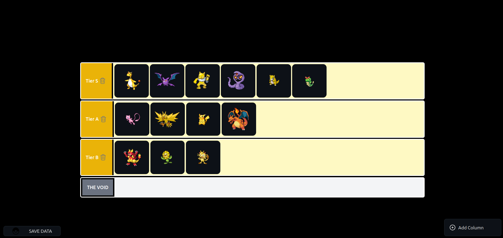

# 🏆 Tier Maker App

A simplified version of the popular TierMaker platform. This web app allows users to create, customize, and export tier lists visually—ideal for ranking anything from anime characters to startup ideas.

## 🔗 Project Description

This project lets users:
- Upload or select items to rank
- Drag and drop items into different tier categories (S, A, B, etc.)
- Customize tier names and colors
- Export the tier list as an image

Built using:
- **Next.js** for frontend routing and page generation
- **Tailwind CSS** for fast, utility-first styling
- Optionally used **Material UI** (due to earlier integration conflicts)

## 📸 Screenshots

 - 

## Demo 

 - 

## 🚀 Getting Started

1. **Clone the Repository**
   ```bash
   git clone https://github.com/Tricky11flame/tier-App.git
   cd tier-App
   ```

2. **Install Dependencies**
   ```bash
   npm install
   ```

3. **Run the App Locally**
   ```bash
   npm run dev
   ```

4. **Note:** This project may require forced dependency fixes:
   ```bash
   npm audit fix --force
   ```

> ⚠️ **Disclaimer**: This project is no longer actively maintained. Some dependencies may be outdated or broken without force fixes.

## 🧩 Features

- Drag-and-drop interface
- Custom tier labels and colors
- Image-based items or name tags
- Export final tier list as an image or screenshot

## 💡 Inspiration

Inspired by [TierMaker](https://tiermaker.com), but built as a personal project to understand dynamic rendering, user state, and media uploads.

## 🛠 Tech Stack

- [React.js]
- [Tailwind CSS](https://tailwindcss.com/)
- [DnD-Kit](https://react-dnd.github.io/react-dnd/about)

## 🧪 Potential Improvements

- Tier sharing via link
- Mobile responsiveness
- Image Uplpoad
- PreBuilt Tier templates (anime, tech stack, etc.)
- Add login & save functionality

## 📦 Folder Structure

# 🧩 Folder Structure

This section breaks down the files and folders of the Tier Maker App project with personal annotations and insights.

---

### 📁 Root Directory

#### `vite-env.d.ts`
> A TypeScript declaration file used to provide type definitions for Vite-specific environment variables. It likely contains:
```ts/// <reference types="vite/client" />
```
This helps TypeScript understand Vite's modules and types.

#### `types.ts`
Defines the main TypeScript types used across the app:
- `Id` - Likely a unique identifier for tasks or columns
- `Color` - Represents theme or column color
- `Column` - Object representing a Kanban column
- `Task` - Object representing a task or card

#### `main.tsx`
> Basic setup file for React app
- Wraps `App.tsx` with `React.StrictMode`
- Uses `BrowserRouter` from `react-router-dom`

#### `index.css`
> Appears to be empty or very minimal in styling

---

### 💡 Core App Files

#### `App.tsx`  
> ⚠️ Handles all routing logic
- Uses `Routes` and `Route` from `react-router-dom`
- Maps route `/` to `<KanbanBoard />`

#### `App.css`
> Contains Tailwind utility class customizations:
- Custom scrollbar styling using `-webkit-scrollbar`
- Tailored for horizontal scrolling and `.task` class

---

### ⚙️ Utility / Misc Files

#### `/scripts/lmao.js`
> A joke file name, but it:
- Generates random color strings and power values
- Possibly used for debugging or test data

#### `/icons/`
Contains SVG-based custom icons:
- `PlusIcon`, `PokeIcon`, `TrashIcon`
> 🎨 Creative custom icons using raw SVG code

#### `/constants/`
- `defaultCols.ts` - Default Kanban columns
- `defaultTasks.ts` - Sample tasks data
> Basic preset values to populate the board

---

### 🧱 Components

#### `KanbanBoard.tsx`
> 🔁 Core logic-heavy component

Uses:
- `useState`, `useEffect`, `useMemo`
- `axios` for data handling
- `dnd-kit/core` & `dnd-kit/sortable` for drag-drop

Handles:
- Column and task states
- Drag events: `onDragStart`, `onDragEnd`, `onDragOver`
- Component rendering:
  - `<DndContext>`
  - `<SortableContext>` for columns
  - `<TheVoid />` for task drop zone
  - Buttons: Create / Save
  - `<DragOverlay>` for dragging UI

Defines several utility functions: `deleteTask`, `createNewColumn`, `generateId`, `saveData`, etc.

#### `ColumnContainer.tsx`
> Represents a draggable Kanban column

- Uses `useSortable` and `SortableContext`
- Handles `editMode` state for renaming columns
- Contains task drop zone mapping `<TaskCard />`
- Uses drag and drop styling and logic

#### `TheVoid.tsx`
> Handles task sorting within a column

- `useSortable`, `SortableContext`, `useMemo`
- Creates a memoized task ID list from props
- Maps each task to a `<TaskCard />`
- Accepts props: `column`, `deleteTask`, `tasks`

#### `TaskCard.tsx`
> Represents each draggable card

Uses:
- `useState` for `editMode` and `mouseIsOver`
- `useSortable` from `dnd-kit`
- Adds trash button visibility on hover
- Uses conditional drag behaviors when in edit mode

---

Each of these components represents a tight integration of **drag-and-drop logic**, **state management**, and **user interactivity**, building up a feature-complete tier-maker style Kanban system.


